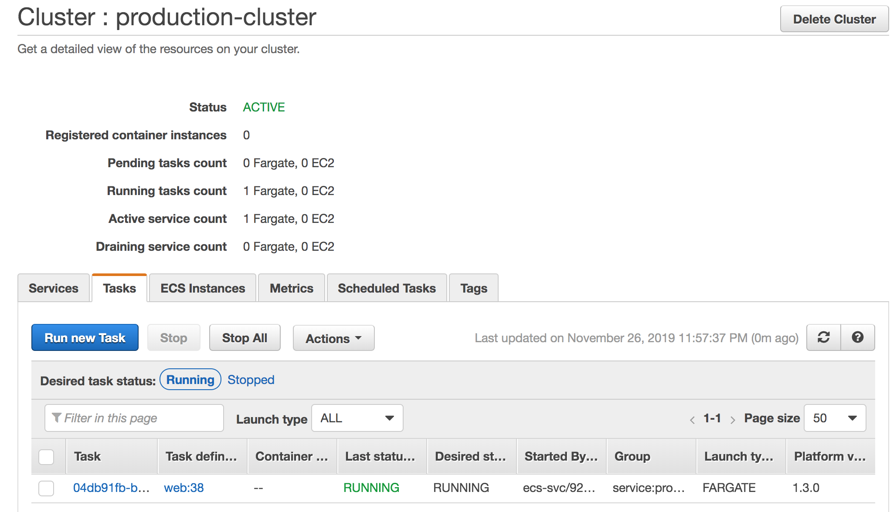
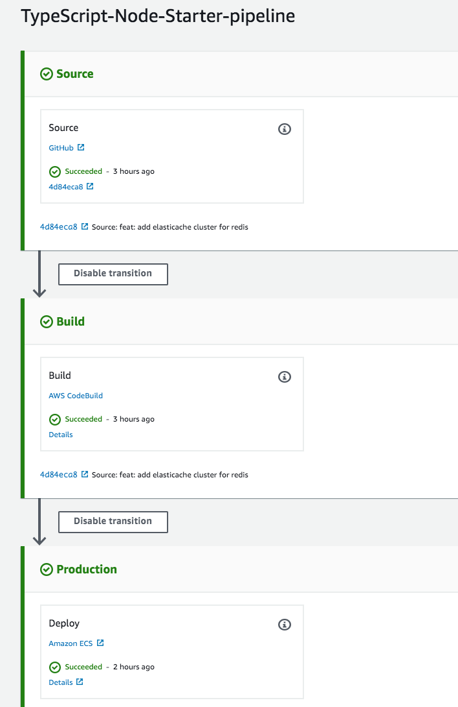
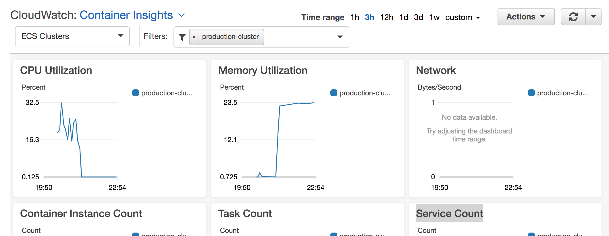

# Deployment solution

This section of the repo provides the Terraform Infrastructure-As-Code to automate the deployment of the app to an AWS ECS cluster. 

The various resources are split into modules so they are re-usable and logically separated.

### How to Run
- Download and Install Terraform. This section is written using Terraform v0.11.13, and I strongly recommend you use that version.

- Create a `terraform.tfvars` and enter all the sensitive variables. Use `terraform.tfvars.example` as a template.

- Run `terraform init`. This would install all dependencies and initialze modules.

- Run `terraform plan`. Address any errors this might bring up.

- Run `terraform apply`. This would provision the infrastructure.

- Navigate to your AWS dashboard and first confirm the CodePipeline instance deployed successfully, then check on the ECS cluster to view logs and the status of the service.

- If the service is all good, you can open the Public DNS address of the ALB (I will define this as a Terraform output) in your browser.

All done!

## Infrastructure Overview

This section will describe the infrastructure as a whole. The resources in the list below are involved in  provisioning the infrastructure. They are split into modules in the code, with each having a README that gives more in-depth detail about its function.

- [ ] **CodeCommit** - This was intended to be the source repository, but it made more sense to pull straight from the Github repo. So I made Github the source instead.

- [x] **ECR (Elastic Container Registry)** - This stores the builds of the docker images.

- [x] **CodeBuild** - Builds docker images and stores them in ECR.

- [x] **ECS (Elastic Container Service)** - Main cluster that contains the docker containers. Uses Fargate to deploy and manage the EC2 instances. 

- [x] **CodePipeline** - Provides continous delivery from source (Github) to build and then deployment.

- [x] **ElastiCache (Redis)** - Cache cluster to run Redis. Resides in the same VPC as the app. Another option would have been to run Redis in another container, but that's not really production-grade.

- [x] **MongoDB Atlas** - Since there is no straightforward way to setup a MongoDB cluster on AWS, it is adviced by even AWS evangelists to go with Atlas at first, which is a free managed service.

- [x] **Networking** - Since the resources are not to be accessed by the general public directly, they are placed into a Virtual Private Cloud (VPC). It contains:
    - A single VPC, which is divided into four subnets (2 public, 2 private) across two availability zones.
    - Network Address Translation (NAT) config for accessing the private subnet through the public.
    - An internet gateway.
    - A default security group config.

# Monitoring

This is implemented with an ECS service called `containerInsights` provided by AWS. It enables monitoring of the ECS cluster using Cloudwatch. Some of the metrics provided include:
- CPU Utilization
- Memory Utilization
- Network
- Container Instance Count
- Task Count
- Service Count
- Avg CPU (%)
- Avg memory (%)

With this setup, alerts can be created using Cloudwatch to notify engineers when resource usage hits a certain threshold. 